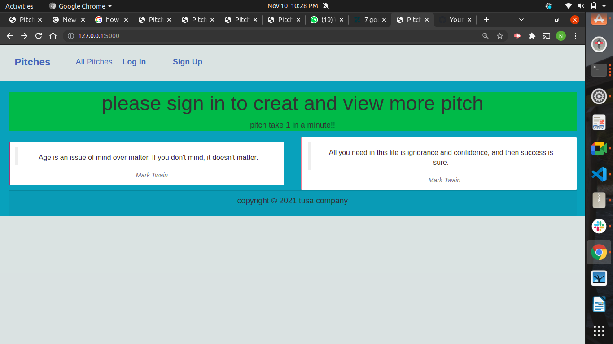

# pitch project

## front page
 

## Description
This application will help user to see pitchs and creat bitch
1. user authentication user registration and login.
2. User creating a pitch
3. user commenting and upvote and down vote

## Setup and installations
1. Clone Project to your machine
2. Activate a virtual environment on terminal: `source venv/bin/activate`
3. Install all the requirements found in requirements file.

## Specifications
1. user Authentication
2.  crating a pitch  

### Prerequisites
* python3.9
* virtual environment
* pip
* psql
# live link https://pitch-nur.herokuapp.com/

#### Initialize git and add the remote repository
bash
git init

bash
git remote add origin https://github.com/Nur-tusa/piches-app.git

#### Create  the virtual environment
bash
python3.9-venv venv
## Activating the environment.
bash
source venv/bin/activate

#### Install dependancies
Install dependancies that will create an environment for the app to run
`pip install -r requirements.txt`

bash
python3.9 manage.py check
python manage.py makemigrations 
python3.9 manage.py sqlmigrate 
python3.9 manage.py migrate

#### Run the app
bash
python3.9 manage.py runserver

Open [localhost:5000](http://127.0.0.1:5000)
## Testing the Application
`python3.9 manager.py test`
## Technologies used
1.  python 3.9 version
2. Flask
3.  Boostrap
4.  HTML
5. CSS
 
 # contacts
 NAME : nur 
 
  address ; 
 
  telephone number: 0115314390

# copyright 
only reserved to tusa @company  only
